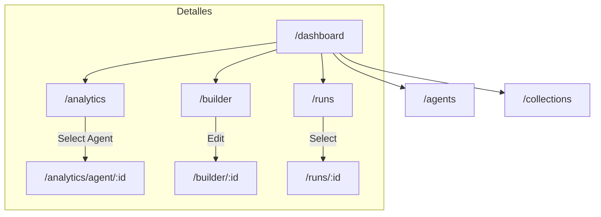
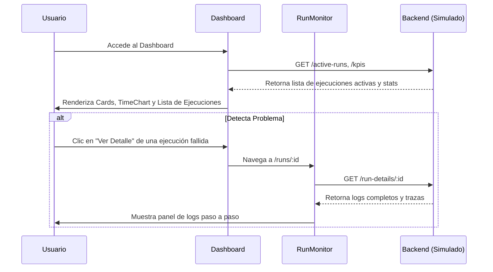
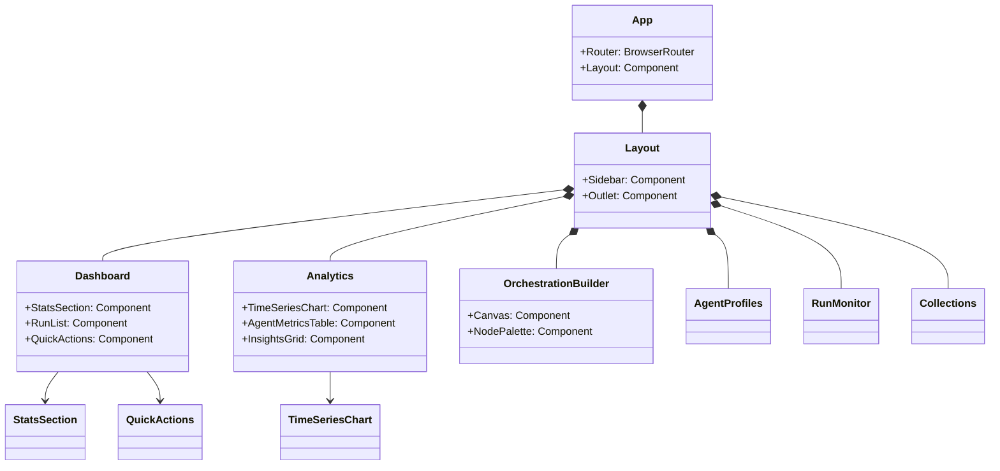
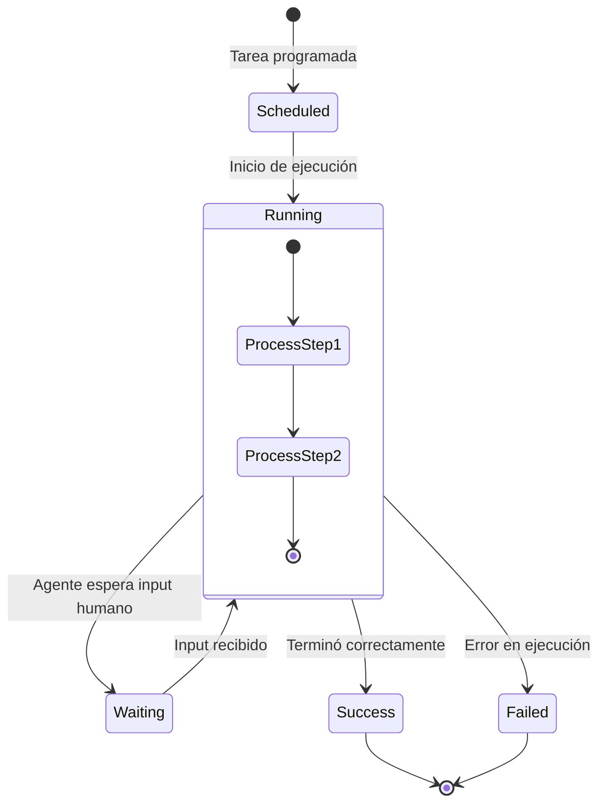

# Diagramas Técnicos y Estructurales - Agent Orchestrator Portal

## 1. Mapa de Navegación del Usuario (Sitemap)

## 2. Diagrama de Secuencia: Flujo de Monitorización de una Ejecución

## 3. Diagrama de Clases / Componentes (UML)

Descripción de la jerarquía de componentes React principales.

## 4. Diagrama de Estado: Ciclo de Vida de una Ejecución (Run)

